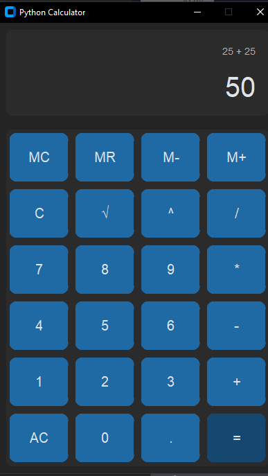

# Python Calculator with CustomTkinter

 
*(Replace with your actual screenshot path)*

A modern GUI calculator built with Python and CustomTkinter, featuring both basic and advanced operations with clean, maintainable code.

## ✨ Features

- **Basic Operations**: +, -, ×, ÷
- **Advanced Functions**: √, x², ^ (power)
- **Memory Operations**: M+, M-, MR, MC
- **Keyboard Support**: Type directly or click buttons
- **Theming**: Light/dark mode toggle
- **History**: Track previous calculations

## 🛠️ Installation

1. Clone the repository:
   ```bash
   git clone https://github.com/yourusername/python-calculator.git
   ```
2. Install dependencies:
   ```bash
   pip install customtkinter
   ```

## 🚀 Usage
Run the calculator:
```bash
python calculator.py
```

**Keyboard Shortcuts**:
- `0-9`, `.` - Number input
- `+`, `-`, `*`, `/` - Basic operations
- `Enter` or `=` - Calculate result
- `q` - Square root
- `^` - Power function

## 📂 Project Structure
```
python-calculator/
├── calculator.py      # Main application code
├── README.md         # Project documentation
├── requirements.txt  # Dependencies
└── screenshot.png    # Application preview
```

## 🤝 Contributing
Pull requests are welcome! For major changes, please open an issue first.

## 📜 License
[MIT](LICENSE)
